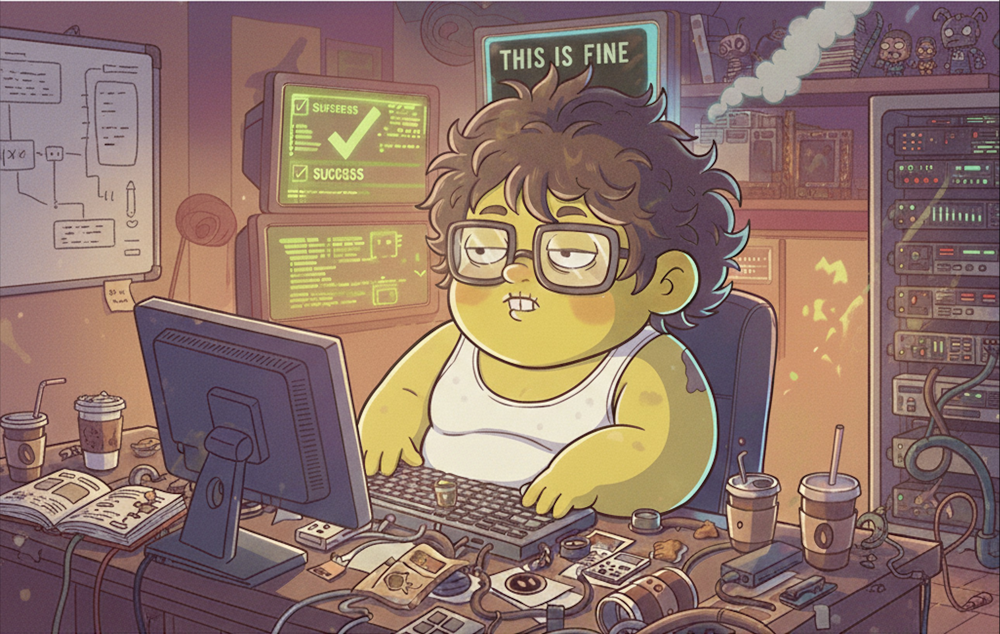

# 🤖 Kiro CLI Ralph



A Kiro CLI adaptation of [snarktank/ralph](https://github.com/snarktank/ralph), the autonomous AI agent loop that runs until all PRD items are complete.

This version adds Docker support and removes git dependency - memory persists via `progress.txt` and `prd.json` instead of git history.

Based on [Geoffrey Huntley's Ralph pattern](https://ghuntley.com/ralph/).

---

## 🚀 Quick Start

### Docker (Recommended)

```bash
cd docker
chmod +x run-kiro.sh
docker compose build

# First time - authenticate
./run-kiro.sh .. login

# Create PRD and run
./run-kiro.sh .. chat
> @prd
> Feature or product would you like to build
> @design
> @ralph Convert project/tasks/prd-*.md to prd.json

# Run Ralph (10 = max iterations)
./run-kiro.sh .. ralph 10 --model=claude-opus-4.6
```

### Local

**Prerequisites:** [Kiro CLI](https://kiro.dev), `jq`

```bash
kiro-cli chat
> @prd
> @design
> @ralph Convert project/tasks/prd-*.md to prd.json

./ralph.sh 10
```

---

## 📋 How It Works

Each iteration spawns a **fresh Kiro CLI instance** with clean context. The only memory between iterations is:
- `prd.json` - which stories are done
- `progress.txt` - learnings and context from previous iterations

### The Loop

```
┌───────────────────────────────────────────────────────────┐
│                     Ralph Iteration                       │
├───────────────────────────────────────────────────────────┤
│                                                           │
│   1. Read prd.json and progress.txt                       │
│   2. Pick highest priority story where passes: false      │
│   3. Implement that single story                          │
│   4. Run quality checks (typecheck, lint, tests)          │
│   5. Browser verify if UI story (via chrome-devtools)     │
│   6. Update prd.json → passes: true                       │
│   7. Append learnings to progress.txt                     │
│   8. Exit (next iteration picks up next story)            │
│                                                           │
└───────────────────────────────────────────────────────────┘
                            │
                            ▼
                ┌───────────────────────┐
                │  All stories pass?    │
                └───────────────────────┘
                     │            │
                    YES          NO
                     │            │
                     ▼            ▼
                ┌────────┐   ┌────────────┐
                │ DONE ✓ │   │ Loop again │
                └────────┘   └────────────┘
```

### Workflow

**1. Create a PRD**
```
@prd
```
Kiro asks what you want to build, then asks clarifying questions. Saves to `project/tasks/prd-*.md`.

**2. Generate Design Directions**
```
@design
```
Reads the PRD and generates 5 distinct visual designs as standalone HTML files in `project/design/`. Open them in a browser to compare.

**3. Convert to prd.json (with design selection)**
```
@ralph Convert project/tasks/prd-*.md to prd.json
```
If designs exist, asks which design (1-5) to use. Creates structured user stories with acceptance criteria referencing the chosen design.

**4. Run Ralph**
```bash
./ralph.sh 10  # or ./run-kiro.sh .. ralph 10
```
Ralph loops until all stories have `passes: true` or max iterations reached.

---

## 🎯 Critical Concepts

### Small, Right-Sized Stories

Each story should complete in **one iteration**. If a task is too big, the LLM runs out of context before finishing.

✅ Good:
- Add a UI component
- Update an API endpoint
- Add a database column

❌ Too big (split these):
- Build entire dashboard
- Add authentication
- Refactor the API

### Feedback Loops

Ralph only works with feedback loops:
- **Typecheck** catches type errors
- **Tests** verify behavior
- **Browser verification** confirms UI works

Without these, broken code compounds across iterations.

### Browser Verification

UI stories include "Verify in browser using chrome-devtools MCP" in acceptance criteria. Ralph will:
1. Start the dev server
2. Navigate to the page
3. Interact with UI elements
4. Take screenshots to confirm changes work

---

## 🐳 Why Docker?

- 🔒 Sandboxed permissions
- 🌐 Includes headless Chrome for browser automation
- 🔑 Auth persists in Docker volumes

---

## 📁 Key Files

| File | Purpose |
|------|---------|
| `ralph.sh` | The bash loop that spawns fresh Kiro instances |
| `.kiro/agents/prompt.md` | Instructions for each iteration |
| `.kiro/prompts/prd.md` | PRD generator skill (`@prd`) |
| `.kiro/prompts/design.md` | Design direction generator (`@design`) |
| `.kiro/prompts/ralph.md` | PRD-to-JSON converter (`@ralph`) |
| `project/prd.json` | User stories with `passes` status |
| `project/progress.txt` | Append-only learnings log |

---

## 🧠 Code Intelligence (Optional)

For better code navigation and refactoring, enable LSP support:

```
kiro-cli chat
> /code init
```

This generates `.kiro/settings/lsp.json` (gitignored). Each developer runs this locally.

---

## 📚 Credits & References

- [snarktank/ralph](https://github.com/snarktank/ralph) - Original Ralph implementation
- [Geoffrey Huntley's Ralph](https://ghuntley.com/ralph/) - The Ralph pattern
